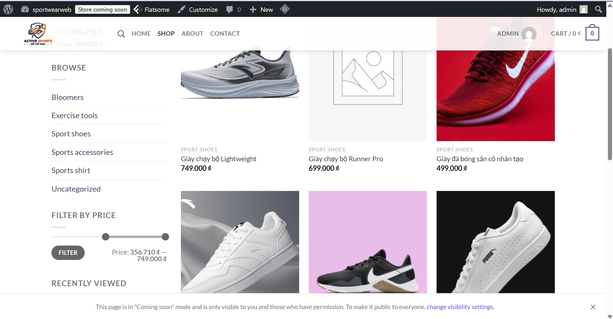
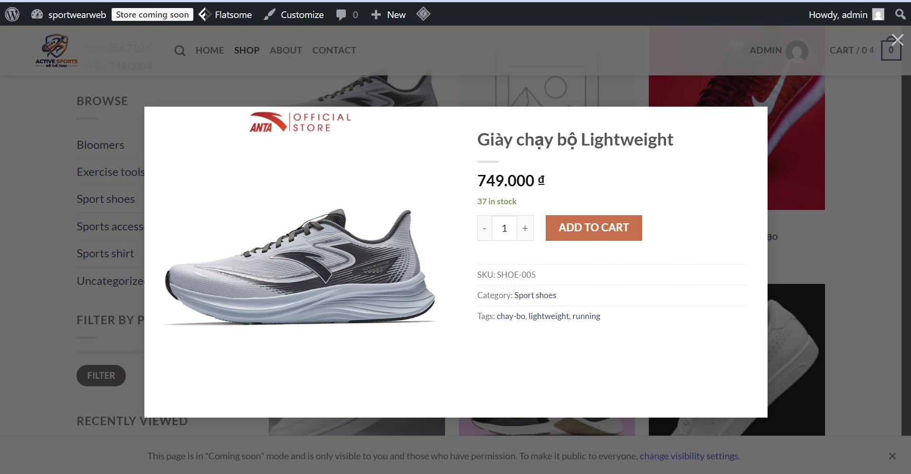
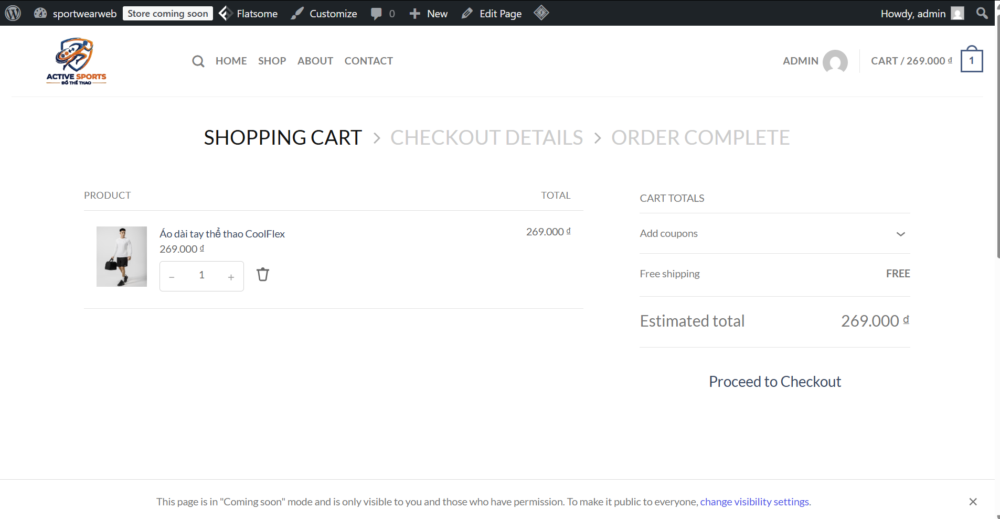
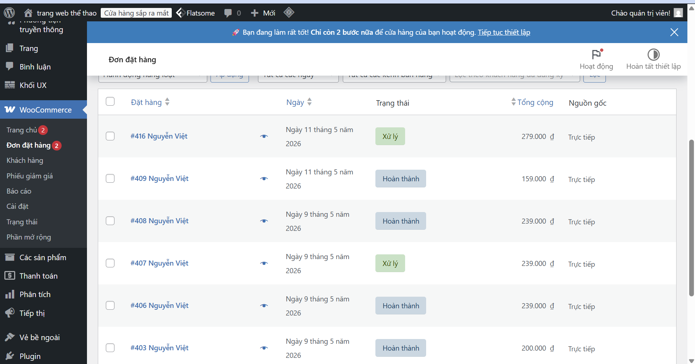

# Tên đề tài
Website bán đồ thể thao `sportWearWeb`

## Giới thiệu website/hệ thống
`sportWearWeb` là website thương mại điện tử bán đồ thể thao được xây dựng trên WordPress + WooCommerce.
Hệ thống hỗ trợ quản lý sản phẩm, giỏ hàng, đặt hàng, thanh toán và quản trị đơn hàng trong trang admin.

Các chức năng chính:
- Hiển thị danh sách sản phẩm theo danh mục.
- Xem chi tiết sản phẩm, thêm vào giỏ hàng.
- Thanh toán qua chuyển khoản VietQR và PayPal.
- Quản lý đơn hàng trong WooCommerce.
- Import sản phẩm bằng file CSV.

## Danh sách thành viên
1. Đỗ Hoàng Nam
2. Nguyễn Hồng Phong

## MSSV từng thành viên
1. Đỗ Hoàng Nam - 23810310303
2. Nguyễn Hồng Phong - 23810310433

## Phân công nhiệm vụ cụ thể
1. Đỗ Hoàng Nam
- Cài đặt môi trường XAMPP và WordPress.
- Cấu hình WooCommerce, danh mục và sản phẩm.
- Tích hợp và cấu hình thanh toán VietQR.
- Quản lý source code và đẩy GitHub.

2. Nguyễn Hồng Phong
- Nhập dữ liệu sản phẩm bằng CSV.
- Chuẩn bị hình ảnh sản phẩm, nội dung mô tả.
- Kiểm thử quy trình đặt hàng và thanh toán.
- Hoàn thiện tài liệu, video demo.

## Công nghệ sử dụng
- PHP, MySQL
- WordPress
- WooCommerce
- Theme: Flatsome
- Plugin: VietQR, WooCommerce PayPal Payments, LiteSpeed Cache, Contact Form 7
- XAMPP (Apache + MySQL)

## Hướng dẫn cài đặt
1. Cài đặt XAMPP.
2. Copy source code vào thư mục `C:\xampp\htdocs\sportWearWeb`.
3. Khởi động `Apache` và `MySQL` trong XAMPP.
4. Tạo database `sportwearweb` trong phpMyAdmin.
5. Import file SQL vào database.
6. Kiểm tra file `wp-config.php`:
- `DB_NAME = sportwearweb`
- `DB_USER = root`
- `DB_PASSWORD = ''` (hoặc mật khẩu MySQL của máy bạn)
- `DB_HOST = localhost`

## Hướng dẫn chạy project
1. Mở trình duyệt và truy cập:
- `http://localhost/sportWearWeb`
2. Vào trang quản trị:
- `http://localhost/sportWearWeb/wp-admin`

## Tài khoản demo
- Tài khoản admin:
- Username: `admin`
- Password: `123456`

## Hình ảnh minh họa hệ thống

## Link video demo
- https://drive.google.com/file/d/17o4Gz9qXwEsJV2H2x_HV5dAv7eBaqMYK/view?usp=sharing

## Link online đã deploy
- https://shopthethao.page.gd/
